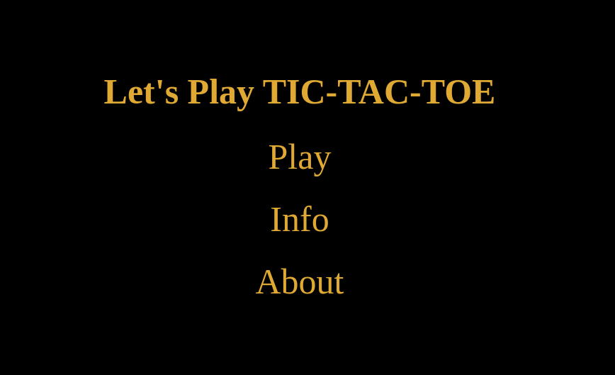
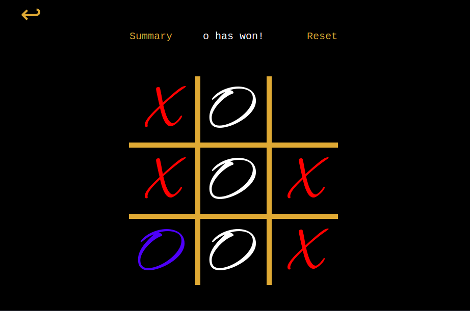

# TIC-TAC-TOE

A Tic Tac Toe game based on Reinforcement Learning. The AI has been trained using iterative Q-learning
The game has been built using the Flask framework. 

Inside [src](https://github.com/aliasgar-m/TIC-TAC-TOE-Game/tree/main/src) 
you will find the code used to train the AI.

## Main Page:
* Play: Start the Game
* Info: How to play the Game
* About: Developer Credits

##  Train Model
```
python3 main.py
```
The model is trained by playing 500000 games. This parameter can be tuned to meet your requirements
within the [main.py](https://github.com/aliasgar-m/TIC-TAC-TOE-Game/blob/main/main.py) itself

## Run
```
python3 app.py
```
and navigate to `http://localhost:5000/`

## Future Improvement
* Starting player for the next game will be decided based on who wins the previous game.
* Currently, the user will start the game when every new game is started
* Documentation of the functions to make the code more easy to understand for beginners.



